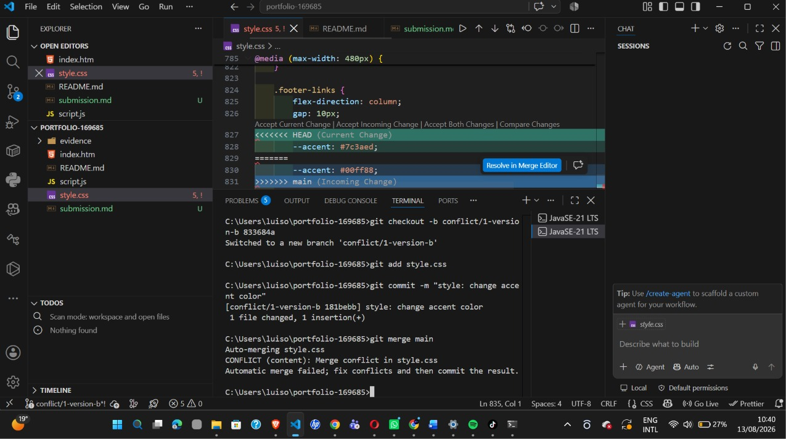
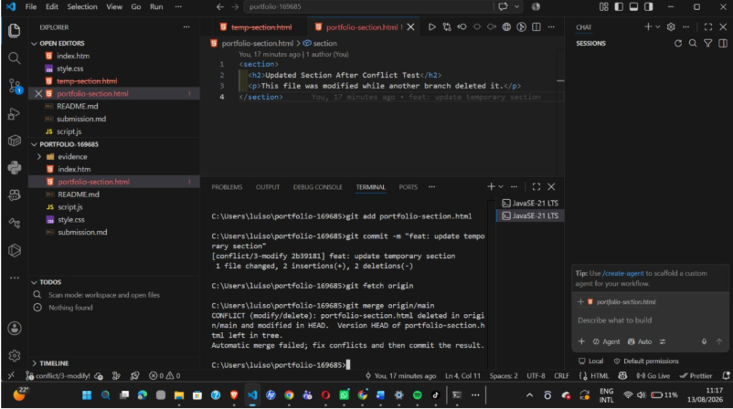

# Project Submission Report

## 1. Student Details

- **Full Name:** Dulo Luis Enrique Okal
- **GitHub Username:** LuisDulo
- **Email:** 169685

---

## 2. Deployed Project Link

- **Live GitHub Pages URL:** https://is-project-2026.github.io/portfolio-169685/

---

## 3. Reflection — Grounded in Your Git History

### A. Your Best Commit

- **Commit URL:** https://github.com/IS-PROJECT-2026/portfolio-169685/commit/aad4e23

- **Why this one?**

I selected this commit because it follows the Conventional Commits
format using the `fix` type and clearly describes the purpose of the
change: improving accessibility. The commit represents a focused change
and is connected to the accessibility improvements tracked in the
project workflow.

---

### B. A Mistake or Struggle

- **Link to the evidence:** https://github.com/IS-PROJECT-2026/portfolio-169685/pull/27

- **What happened and how did you recover?**

One of the main challenges during the project was creating and resolving
merge conflicts. Different branches contained incompatible changes, so
Git could not automatically combine them. I recovered by reviewing the
conflicting versions, manually resolving the files, staging the resolved
changes, and completing the merge through the Git workflow.

---

### C. A Pull Request You're Proud Of

- **PR URL:** https://github.com/IS-PROJECT-2026/portfolio-169685/pull/24

- **What did you check before merging?**

Before merging, I reviewed the changed files to make sure the pull
request only contained changes related to accessibility and responsive
behavior. I also checked the PR description, issue linkage, and the
final diff before merging it into `main`.

---

### D. One Thing You Would Do Differently

- **What would you change?**

If I restarted this project, I would set up all milestones, issues, the
project board, and the complete branching workflow before making the
first development commit. This would make the relationship between
issues, branches, commits, and pull requests clearer from the beginning.

- **Link to the evidence of the original decision:**

https://github.com/IS-PROJECT-2026/portfolio-169685/pull/15

---

# 4. Screenshots of Key GitHub Features

## A. Milestones and Issues

<!-- UPDATE: PASTE YOUR MILESTONES AND ISSUES SCREENSHOT DIRECTLY BELOW -->

- **Caption:**

The portfolio project was organized into multiple development milestones.
Each milestone was divided into granular GitHub Issues that tracked
specific tasks and features throughout the project.

---

## B. Project Board

<!-- UPDATE: PASTE YOUR GITHUB PROJECT BOARD SCREENSHOT DIRECTLY BELOW -->

- **Caption:**

The GitHub Project Board was used to track tasks as they moved through
the `To Do`, `In Progress`, and `Done` columns during development.

---

## C. Branching Architecture

<!-- UPDATE: PASTE YOUR BRANCH LIST SCREENSHOT DIRECTLY BELOW -->

- **Caption:**

The project used issue-linked branches with prefixes such as `feat/`,
`fix/`, `style/`, `docs/`, and dedicated conflict branches. Development
work was isolated on branches and integrated into `main` through pull
requests.

---

## D. Pull Requests & Traceability

<!-- UPDATE: PASTE A SCREENSHOT OF ONE OF YOUR PULL REQUESTS DIRECTLY BELOW -->

- **Caption:**

This pull request demonstrates the relationship between a development
branch, the changes being reviewed, and the related GitHub Issue. The
pull request provides traceability by linking the development work to
the issue it resolves.

---

# 5. Merge Conflict Evidence

## Conflict 1 — Full Chronology

**What cause did you use?**

Same-line modification conflict.

This conflict was created when different branches made incompatible
changes to the same section of `style.css`. Git could not automatically
determine which version should be retained.

---

### Step 1: Generating the Clash

<!-- UPDATE: PASTE YOUR SCREENSHOT SHOWING THE MERGE ATTEMPT AND CONFLICT WARNING BELOW -->

- **Caption:**

The merge attempt caused a conflict because both branches contained
different changes to the same section of `style.css`. Git stopped the
merge and reported that the conflict needed to be resolved manually.

---

### Step 2: Inside the Code Editor — Conflict Markers

<!-- UPDATE: PASTE THE SCREENSHOT SHOWING <<<<<<< HEAD, =======, AND >>>>>>> BELOW -->

- **Caption:**

The editor displayed the raw conflict markers `<<<<<<< HEAD`,
`=======`, and `>>>>>>>`, showing the two competing versions of the
same CSS section. I reviewed both versions and selected the appropriate
final styling before removing the conflict markers.

---

### Step 3: Resolution and Clean Merge

<!-- UPDATE: PASTE YOUR SCREENSHOT SHOWING THE SUCCESSFUL RESOLUTION, CLEAN MERGE, OR GIT HISTORY BELOW -->

- **Caption:**

After resolving the conflicting CSS, I removed the conflict markers,
staged the corrected file, and completed the merge. The final Git
history shows that the conflict was successfully resolved and the
changes were integrated.

---

## Conflict 2 — Different Cause

**What cause did you use?**

Rename versus modification conflict.

**Why does this cause trigger a conflict?**

A rename versus modification conflict occurs when one branch renames a
file while another branch independently modifies that file. Git may not
be able to automatically determine how the modifications should be
applied to the renamed version, requiring manual resolution.

<!-- UPDATE: PASTE YOUR CONFLICT 2 SCREENSHOT BELOW -->

- **Caption:**

The conflict occurred because one branch renamed the file while another
branch contained independent modifications to the original file. The
conflicting changes were reviewed and manually resolved before the merge
was completed.

---

## Conflict 3 — Different Cause

**What cause did you use?**

Modify/Delete conflict.

**Why does this cause trigger a conflict?**

This conflict occurs when one branch deletes a file while another branch
modifies that same file. Git cannot automatically determine whether the
final version should keep the modified file or preserve the deletion, so
manual resolution is required.

<!-- UPDATE: PASTE YOUR CONFLICT 3 SCREENSHOT SHOWING THE MODIFY/DELETE CONFLICT BELOW -->

- **Caption:**

The conflict occurred in `portfolio-section.html` because one branch
deleted the file while the other branch contained modifications to it.
Git reported a modify/delete conflict and required a manual decision
about the final state of the file.

---

# 6. Feedback & Evaluation

To help improve this course for future engineering cohorts, please take
2 minutes to fill out the anonymous feedback form.

- [ ] **Anonymous Evaluation Form:** [Course & Instructor Evaluation](https://forms.gle/YLybnsyXXErKEg3s9)

---

# Final Submission

This project is a personal developer portfolio developed as a functional
static website and managed using a professional Git and GitHub workflow.

The project workflow included:

- GitHub milestones for major development phases
- Granular GitHub Issues for individual tasks
- A Kanban Project Board with `To Do`, `In Progress`, and `Done`
  workflow stages
- Issue-linked development branches
- Conventional Commits using multiple commit types
- Pull Requests for integrating work into `main`
- Three merge conflicts created from different causes
- Manual conflict resolution and documented evidence
- GitHub Pages deployment

The final deployed portfolio is available at:

https://is-project-2026.github.io/portfolio-169685/

---

## Final Submission Form

Submit the completed assignment through the official submission form:

https://forms.gle/KrT4VxtFtkU3wtYu8
